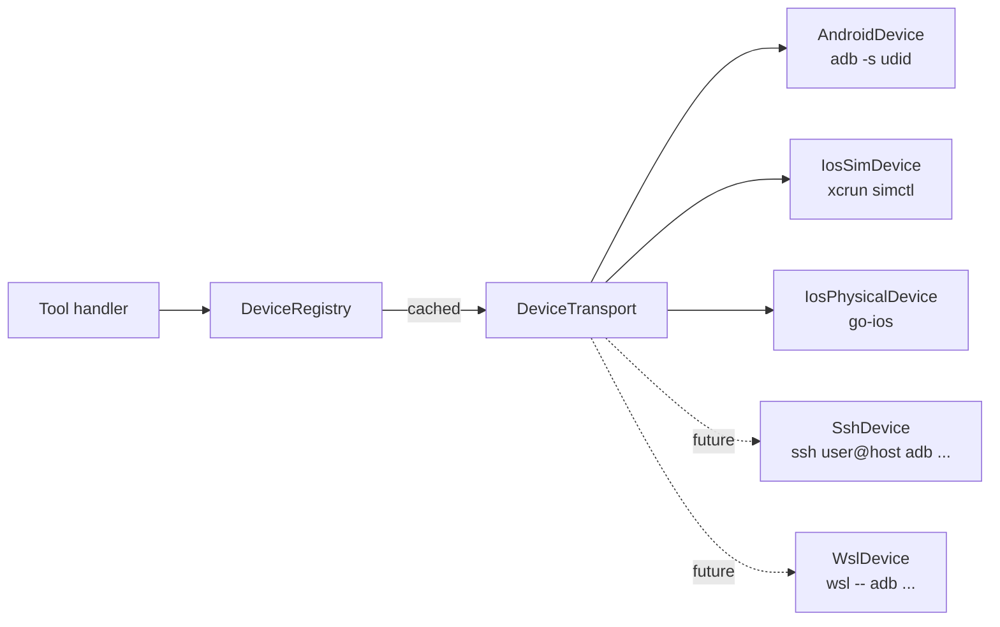

# `@flutter-ultra/flutter-ultra-native-mobile`

MCP server for **native mobile overlay automation**: Android UIAutomator via `adb`, iOS XCUITest via `xcrun simctl` (simulators, Mac only) and `go-ios` (physical devices). Owns the **Chrome Custom Tabs / SafariViewController OAuth** problem with the `solve_oauth_cct` composite tool — see [plan §5.5.1](../../docs/) for the full design.

Part of the **Flutter Ultra MCP** plugin for Claude Code. The server runs as one of the eight MCP processes registered in `.mcp.json`.

## Tool catalogue

| Tool                                                          | Class | Purpose                                                 |
| ------------------------------------------------------------- | ----- | ------------------------------------------------------- |
| `list_devices`                                                | quick | Enumerate Android + iOS (sim + physical) devices        |
| `dump_a11y_tree`                                              | long  | Dump UIAutomator XML / XCUITest a11y as structured tree |
| `wait_for_native_element`                                     | long  | Poll the a11y tree until a finder matches               |
| `native_tap`                                                  | quick | Tap by coordinates or finder (bounds-center)            |
| `native_type`                                                 | quick | Type into focused input                                 |
| `native_swipe`                                                | quick | Swipe between two coordinates                           |
| `native_back` / `_home` / `_app_switch` / `_open_settings`    | quick | System keys / intents                                   |
| `native_pin_lock`                                             | quick | Toggle Android lock-task (kiosk mode)                   |
| `dismiss_permission_dialog`                                   | quick | Smart allow/deny on runtime permission prompt           |
| `native_permission_grant` / `_deny`                           | quick | `pm grant` / `pm revoke`                                |
| `take_device_screenshot`                                      | quick | Base64 PNG via image content                            |
| `set_device_orientation`                                      | quick | Portrait / landscape                                    |
| `native_clipboard_set` / `_get`                               | quick | Device clipboard                                        |
| `start_device_logs` / `poll_device_logs` / `stop_device_logs` | quick | Split-tool logcat / oslog tail                          |
| `solve_oauth_cct`                                             | long  | CCT/SVC OAuth via Playwright + deep-link dispatch       |

All long-running tools are wrapped by the shared `runWithWatchdog` so the 60-second MCP client ceiling never kills them.

## Architecture

Every tool routes shell commands through a `Device` abstraction:

```text
Tool handler ─► registry.get(deviceId) ─► AndroidDevice  ─► adb -s <udid> ...
                                       ─► IosSimDevice   ─► xcrun simctl ...
                                       ─► IosPhysicalDev ─► go-ios       ...
```

`AndroidDevice` / `IosSimDevice` / `IosPhysicalDevice` all implement the same `DeviceTransport` interface (`shell()`, `upload()`, `download()`, `isAlive()`, `dispose()`). A future remote-device adapter (WSL, SSH) drops in by implementing the same interface — no tool code changes.



## CCT OAuth bypass — `solve_oauth_cct`

Chrome Custom Tabs and SafariViewController hide the OAuth flow behind a system-owned web view that no UI driver can introspect. We do **not** try to drive CCT directly. Instead:

1. Launch Playwright Chromium with the provider's `authorize` URL.
2. Submit credentials (optional `fillFlow`) — pause for human MFA when needed.
3. Intercept the redirect to the app scheme (`com.example.myapp://callback?code=…`) before Chromium drops it as `ERR_UNKNOWN_URL_SCHEME`.
4. Deliver the same URL into the app via `Device.shell()`:
   - Android: `adb shell am start -W -a android.intent.action.VIEW -d <url>`
   - iOS Sim: `xcrun simctl openurl <udid> <url>`
   - iOS physical: requires `idb` (out of scope for this server today).

The Flutter app's deep-link handler cannot distinguish the dispatched intent from a real CCT close — the same `Intent.ACTION_VIEW` arrives with the same URL. PKCE state stays valid because the app initiated the flow (its `code_verifier` is in its own memory).

## Configuration

| Env var                                   | Default      | Purpose                                 |
| ----------------------------------------- | ------------ | --------------------------------------- |
| `FLUTTER_ULTRA_ADB`                       | `adb`        | Path to the `adb` binary                |
| `FLUTTER_ULTRA_XCRUN`                     | `xcrun`      | Path to `xcrun`                         |
| `FLUTTER_ULTRA_GO_IOS_BIN`                | `ios`        | Path to the go-ios `ios` CLI            |
| `FLUTTER_ULTRA_TOOL_TIMEOUT_<NAME_UPPER>` | tool default | Override per-tool watchdog ceiling (ms) |
| `FLUTTER_ULTRA_LOG_LEVEL`                 | `info`       | `debug` / `info` / `warn` / `error`     |

## Platform support

| Tool                                 | Linux             | macOS | Windows                        |
| ------------------------------------ | ----------------- | ----- | ------------------------------ |
| Android tools                        | yes (adb on PATH) | yes   | yes                            |
| iOS Simulator tools                  | no                | yes   | no                             |
| iOS physical (go-ios)                | yes               | yes   | yes (depends on go-ios binary) |
| `solve_oauth_cct` (Android dispatch) | yes               | yes   | yes                            |
| `solve_oauth_cct` (iOS sim dispatch) | no                | yes   | no                             |

iOS tools called on non-darwin hosts return a structured "unsupported" payload (per AC-NM3) — they do not crash the server.

## Acceptance criteria

- **AC-NM1** — `dismiss_permission_dialog(intent='allow')` clears a runtime permission within 3s on the Android emulator.
- **AC-NM2** — On iOS Simulator (Mac), `native_tap` on a SafariViewController OAuth login button completes the flow combined with `wait_for_url`.
- **AC-NM3** — iOS tools cleanly return `unsupported` on win32 / linux.
- **AC-NM4** — `solve_oauth_cct` end-to-end completes an OIDC OAuth flow against your identity provider on Android emulator within 60s.

## Development

```bash
npm install                                    # at repo root
npm run -w @flutter-ultra/flutter-ultra-native-mobile build
npm run -w @flutter-ultra/flutter-ultra-native-mobile test
```

The unit-test suite focuses on the host-side parsers (`adb devices -l`, UIAutomator XML, simctl JSON) and the `Device` abstraction — full device-loop tests require an attached Android emulator and live in the cross-platform e2e workflow.
